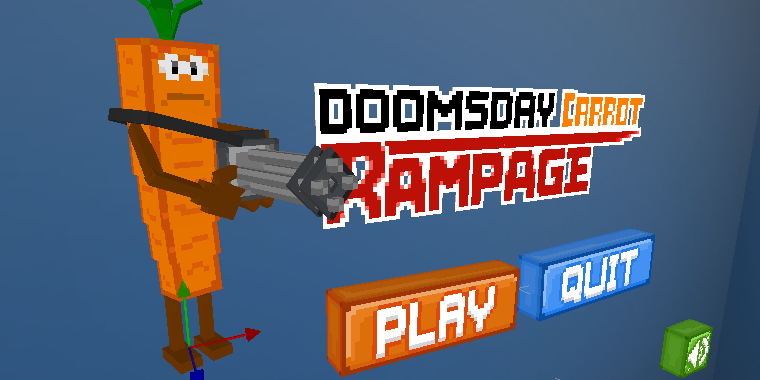

# Средство для совместного создания кросс-платформенных 3D или 2D игр в режиме реального времени

[CraftStudio](http://craftstud.io/) дает вам возможность **сделать полноценную отдельную 2D или 3D игру**. Сделайте свои анимированные 3D карты и персонажей, поместите их на сцены, добавьте их поведение и воплотите свою игру в жизнь!

Вы можете скачать бесплатную демо-версию на [craftstud.io](http://craftstud.io/) - Она работает на **Windows, Mac и Linux**. Купив [полную версию](http://craftstud.io/purchase), вы сможете редактировать ваши собственные скрипты, запускать созданные вами игры, где угодно их публиковать  и даже продавать, если вы захотите.

## Сотрудничество

Вы можете редактировать wiki чтобы сделать её более полной или точной. Пожалуйста, придерживайтесь того же стиля, что и существующая страница. Внося свой вклад, вы соглашаетесь с лицензией об изменениях содержимиго [Creative Commons BY-SA 3.0 license](http://creativecommons.org/licenses/by-sa/3.0/).

Если вы хотите предложить существенные изменения или у вас есть комментарии, пожалуйста [создайте тему на форуме](http://craftstudioforums.net/index.php?forums/discussions.16/create-thread).

----

# Серии учебника

## Начало работы

  * [Начало в CraftStudio](Tutorials/Introduction) — Познакомитесь с тем как CraftStudio работает и создайте свой первый проект
  * [Публикование вашей CraftStudio игры](Tutorials/Publishing) — Отправьте вашу игру, чтобы в нее могли играть другие

## Визуальное программирование

  * [Создание космического шутера](Tutorials/Space_shooter) — Создайте свою первую игру изучая модели, движение и создание скриптов, звуковые эффекты и прочее

## Программирование на LUA

  * [Создание шутера от первого лица](Tutorials/FPS) — Осматривайтесь при помощи мыши, стреляйте в предметы
  * [Создание онлайн игры на подобии Bomberman](Tutorials/Blast_Turtles) — Создайте вашу первую онлайн игру

----

# Материалы

  * [Словарь](Reference/Glossary) — Значение различных слов, используемых в CraftStudio
  * **[Справка по программированию](Reference/Scripting)** — Документация по всем функциям Lua
  * [Обзор движка](Reference/Engine) — Игровой цикл & другая информация о внутренней работе CraftStudio
  * [Управление сервером](Reference/Server) — Команды сервера & информация по установке
  * [Формат файлов](Reference/File_Formats) — Документация по форматам файлов CraftStudio

----

# Дополнительные ресурсы

## Информация для разработчиков

  * [Дорожная карта](Roadmap) — Планы по улучшениям в будущих обновлениях
  * [Блог Sparklin Labs](http://blog.sparklinlabs.com/)

## Видео-урок

  * [Game School - CraftStudio ](http://www.youtube.com/playlist?list=PL41iJfA2iBPF-Y5o7rvQeCWC6LAnktmGF) — Видео-уроки от [Adam Clarke](http://twitter.com/thecommonpeople) с углубленным объяснением, охватывающие различные темы создания игр в CraftStudio
  * [NotExplosive's CraftStudio](http://www.youtube.com/playlist?list=PL0WSCHfZ9lu-eSRb-tk5A6e7ag0k9f_A5) — Видео введение в различные части CraftStudio : моделирование, создание карт и сцен

## Разное
 
  * [Использование CraftStudio для создания модов к Minecraft](Minecraft)
  * [Библиотека Daneel](https://github.com/florentpoujol/Daneel) — Библиотека на Lua для CraftStudio которая направлена на то, "чтобы сократить код, который вы пишете"