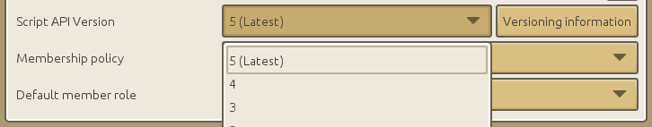

# Upgrading your project to the latest script API version

You can decide which version of the API to use by going in the Administration tab of your project (little gear icon in the top right corner of the home tab).



It is highly recommended to always use the latest version, obviously.

New projects always use the latest version by default. Existing projects are not automatically migrated though.

----
# Version 5 (Runtime 1.0.0.0 - aka CraftStudio Beta)

Strict global variables are now enabled. This means you can't assign a value to a non-local variable in a function, unless it has already been assigned a value at the root of a script.

This helps avoid accidental global variables which are common place in Lua, by making sure you actively declare your globals as such.

Why is this a good thing?

  * Global variables will stay alive for as long as you game runs. When done accidentally, this might lead to memory leaks.
  * Accessing local variables has better performance characteristics than accessing globals.

Here's how it works:
 
```lua
declaredVariable = nil

function MyFunction()
   -- Assigning to a previously declared global variable: Works
   declaredVariable = 5

   -- Assigning to a new local variable: works
   local myVariable = 5

   -- Assigning to an undeclared variable: Raises an error
   undeclaredVariable = 5
end
```

----
# Version 4 (Runtime 0.1.29.0)

This version changes the signature of ```GameObject:GetScriptedBehavior```

In previous versions, ```GameObject:GetScriptedBehavior``` would accept a string representing the full path of the script whose corresponding behavior was to be returned.

For better consistency with ```GameObject:CreateScriptedBehavior``` and other functions, ```GameObject:GetScriptedBehavior``` now accepts a reference to the script itself.

```lua
self.gameObject:GetScriptedBehavior( "Folder/Some Script" )
```

Should be rewritten as:

```lua
self.gameObject:GetScriptedBehavior( CS.FindAsset( "Folder/Some Script" ) )
```

----
# Version 3 (Runtime 0.1.14.0)
This version fixes the sign of ```Vector3:Forward()``` and ```Vector3:Left()```.

In previous versions, ```Vector3:Forward()``` returned (0,0,1) which is inconsistent with CraftStudio's coordinate system. Starting with version 3 of the API, ```Vector3:Forward()``` returns a vector with a value of (0,0,-1).

Same goes for ```Vector3:Left()``` which returned (1,0,0) instead of (-1,0,0).

```Vector3:Up()``` remains unchanged as it was already properly defined as (0,1,0).

----
# Version 2 (Runtime 0.1.6.0)

This version introduces an initial version of the ```Quaternion``` class and ```Transform:Rotate``` and ```Transform:RotateLocal``` now expects quaternions.

Existing code using ```Transform:Rotate``` / ```Transform:RotateLocal``` with Euler angles should either switch to ```Transform:RotateEulerAngles``` / ````Transform:RotateLocalEulerAngles``` or use quaternions.

Quaternions are [mathematical objects](http://en.wikipedia.org/wiki/Quaternions_and_spatial_rotation) used to represent rotations and orientations. They are made of four components (often named X, Y, Z and W) but you can think of them as some kind of opaque, magic object describing orientations efficiently.

You can compose orientations by multiplying two quaternions (the order is important, composing A \* B doesn't give the same resulting orientation as B \* A).

----
# Version 1 (Runtime 0.1.4.0)

This version introduces several math classes that provide useful operations: ```Vector3```, ```Ray```, ```Plane```.

```Transform:SetPosition```, ```Transform:SetLocalPosition```, ```Transform:SetLocalScale```, ```Transform:SetLocalEulerAngles```, ```Transform:Move```, ```Transform:MoveLocal```, ```Transform:MoveOriented```, ```Transform:Rotate``` and ```Transform:RotateLocal``` now take a ```Vector3``` as an argument instead of 3 numbers.

Previously you would have written:

```lua
self.transform:SetLocalPosition( 10, 5, 3 )
```

The new version should read:

```lua
self.transform:SetLocalPosition( Vector3:New( 10, 5, 3 ) )
```

----
# Version 0 (Runtime 0.1.3.0 and earlier)
First version.