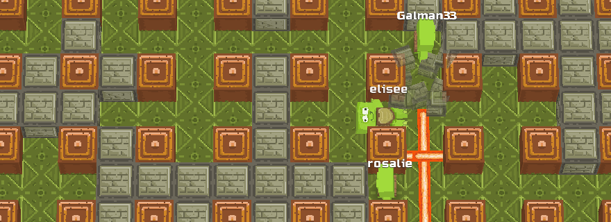
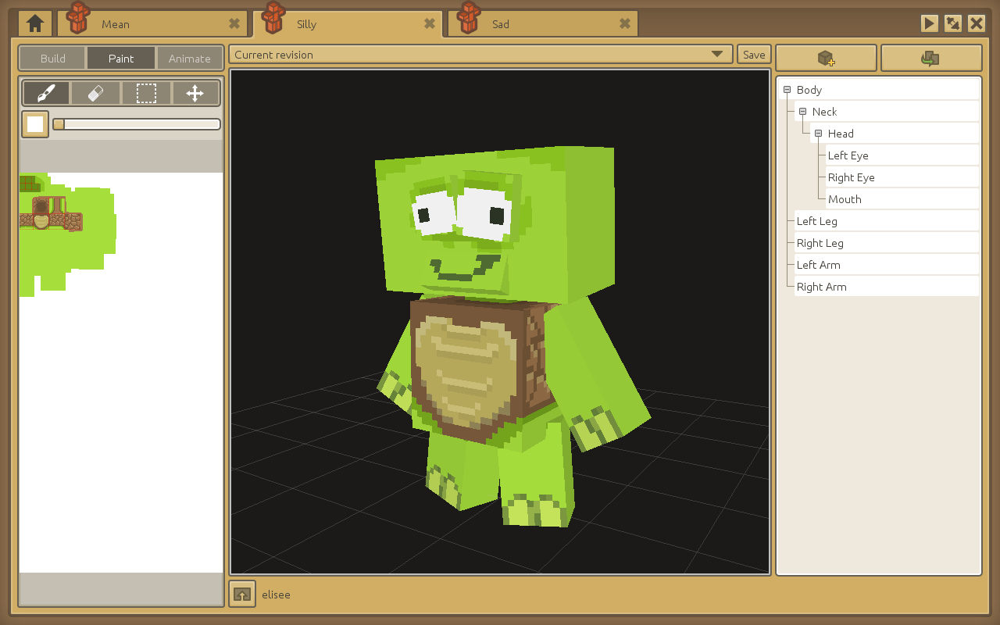
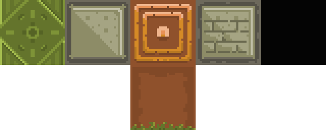
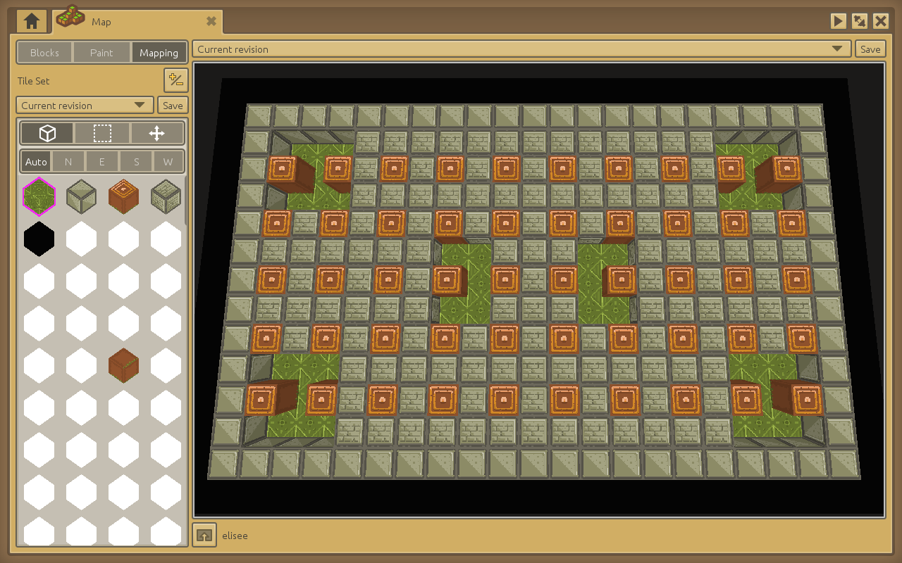
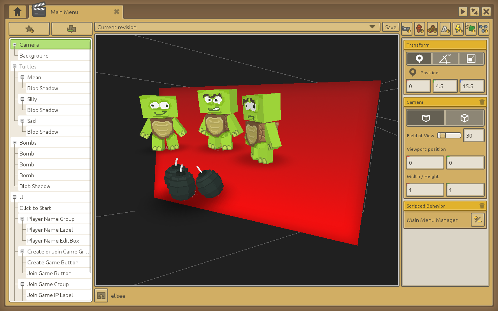
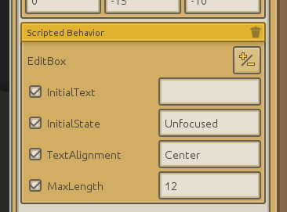
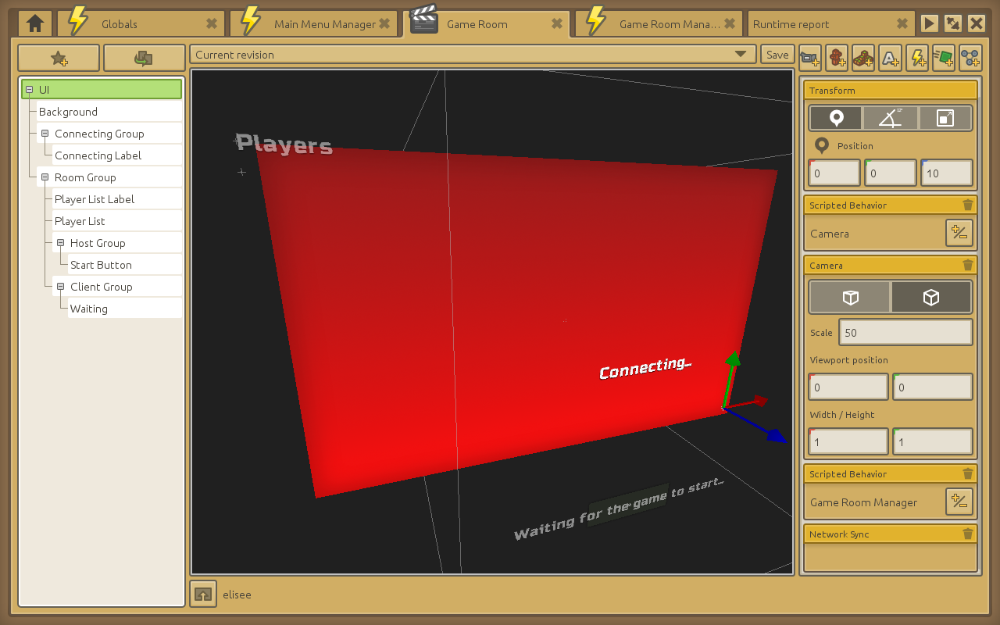
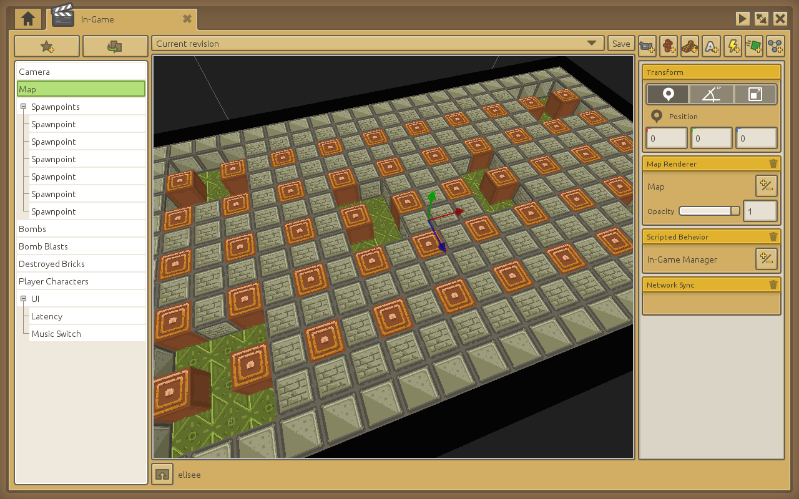
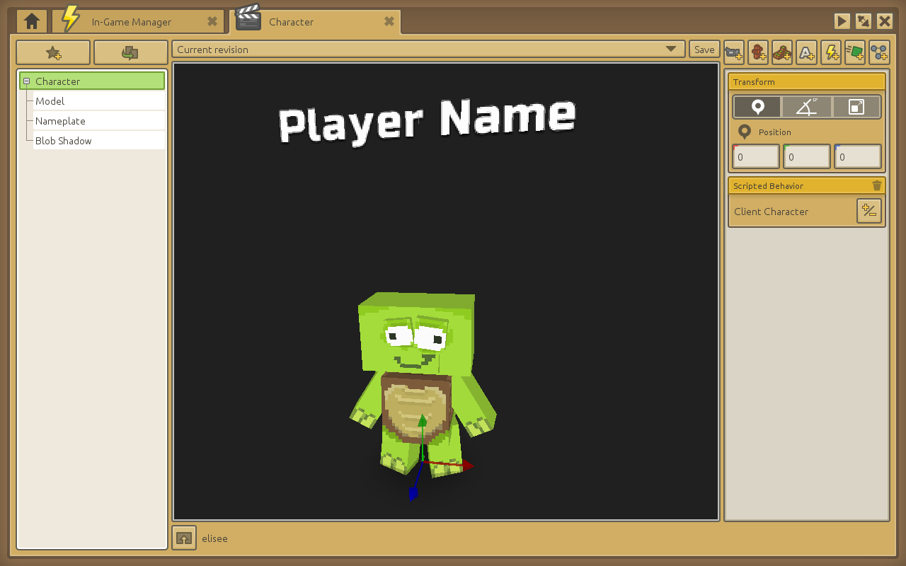

# Construire un jeu multijouers à la Bomberman

----

## Ce qui sera traité dans ce tutoriel

Ce tutoriel considère que vous maîtrisez déjà un minimum CraftStudio. S’il s’agit de votre premier jeu, je vous conseille de consulter l’introduction à CraftStudio et de commencer avec un tutoriel de jeu plus adapté aux débutants.

Le tutoriel sera principalement centré autour du réseau et de la construction d’un jeu multijoueurs en ligne. On aura des mécaniques de jeu plutôt simples tout en faisant quelque chose de sympathique à jouer !



Notre jeu, qui s’appellera **Blast Turtles**, sera un jeu à la Bomberman. 
[Bomberman](http://fr.wikipedia.org/wiki/Bomberman) est un jeu de stratégie dans lequel vous incarnez un personnage qui pose des bombes dans le but de faire exploser les briques alentours et d’éliminer ses opposants afin d’être le dernier survivant.

<iframe width="880" height="495" src="//www.youtube.com/embed/c-Kz7AWGZf8" frameborder="0" allowfullscreen></iframe>

----

## Suivre sur le projet

Avant de commencer, je vous recommande de [rejoindre le projet dans CraftStudio](http://open.craftstud.io/craftstud.io/62dcb6be-3260-4b23-91e4-16f7fa7cd82b) afin de pouvoir suivre le tutoriel tout en regardant le projet.

----

## Les tortues et la map

Les joueurs contrôleront un personnage avec un style cartoon qui est en fait une tortue comme celle-ci :



<!-- <iframe src="http://store.craftstud.io/viewer?"></iframe> -->

Les tortues se déplaceront de case en case dans une map en plein écran. La map (typique des maps qu’on retrouve pour ce type de jeu) a un sol fait d’herbe, la bordure faite de blocs de roc ainsi que les colonnes en bois sont incassables. Les briques qui se trouvent dans le niveau sont quant à elles destructibles avec une bombe. Voici le tileset qui a une taille de 32x32x32 :


La zone jouable fait 19 blocs de long et 11 de haut. Voici un aperçu de la map :



Comme vous pouvez le voir, 6 zones d’apparition des joueurs ont été creusées ( 4 au niveau des coins et 2 au milieu). Nous aurons donc une limite de 6 joueurs dans notre jeu.

----

## Menu principal

Le jeu démarre avec la scène du menu principal qui attend que le joueur clique.



Le script qui gère ce menu est nommé ```Main Menu Manager```. Une fois que le joueur a cliqué, un timer est lancé et les bombes volent en dehors de l’écran (veuillez regarder la fonction ```Behavior:Update``` du ```Main Menu Manager```).


### Demander son nom au joueur

Afin de permettre au joueur d’entrer son nom et de cliquer sur les boutons, le jeu utilise quelques scripts d’interface utilisateur mis ensemble (ils se trouvent dans le dossier ```Menu/UI``` du projet).


Le prompt du “Player Name” est crée par l’objet de jeu ```Player Name EditBox``` avec un composant de comportement scripté comme ceci :



Le texte est affiché grâce au composant ```TextRenderer``` sur l’enfant d’un objet de jeu
et le curseur est dessiné par un autre enfant d’objet de jeu avec un rendu de modèle.

Une fois que l’animation des bombes est passée, la boîte d’édition (EditBox) reçoit le focus &mdash; en appelant ```editBoxGameObject:SetState( "Focused" )```&mdash; qui configure le gestionnaire événements ```CS.Input.OnTextEntered``` comme ceci :

```lua
-- (extract from the Menu/UI/EditBox script)

-- This function, passed as a parameter to CS.Input.OnTextEntered below,
-- will be called whenever the player types something.
self.onTextEntered = function( char )
    -- The typed character is converted into its numerical ASCII index
    local charNumber = string.byte(char)
    
    -- 8 stands for Backspace
    if charNumber == 8 then
        -- Erase the last character from the EditBox's text
        self.gameObject.text = self.gameObject.text:sub( 1, #self.gameObject.text - 1 )
    -- 13 is Return
    elseif charNumber == 13 then
        -- If a "validation" callback function has been set, call it
        if self.onValidateCallback ~= nil then
            self.onValidateCallback( self.gameObject )
        end
    -- Any character between 32 and 127 is regular printable ASCII
    elseif charNumber >= 32 and charNumber <= 127 then
        -- As long as we haven't exceeded the max field length, append it
        if #self.gameObject.text < self.MaxLength or self.MaxLength == 0 then
            self.gameObject.text = self.gameObject.text .. char
        end
    end
    
    -- Update the text displayed by the text renderer and the cursor's position
    self.textGO.textRenderer:SetText( self.gameObject.text )
    self:UpdateCursor()
end

-- (...)

CS.Input.OnTextEntered( self.onTextEntered )
```

Dans le script ```Main Menu Manager```, une fonction de retour de validation est configurée quand le joueur appuie sur la touche Retour.

```lua
-- (extract from Menu/Main Menu/Main Menu Manager)

function Behavior:Start()
    -- (...)
  
    HideSetupPlayerName = function()
        -- Switch the EditBox to Unfocused state
        -- so that it clears the OnTextEntered callback
        self.playerNameEditBox:SetState( "Unfocused" )
        
        -- Scale the whole group to 0 to make it disappear
        self.playerNameGroup.transform:SetLocalScale( Vector3:New(0) )
    end
    
    -- (...)
    
    -- Player Name
    self.playerNameEditBox:OnValidate( function()
        -- Ensure the player name is at least 3 characters long
        if #self.playerNameEditBox.text < 3 then return end
        
        PlayerName = self.playerNameEditBox.text
        
        HideSetupPlayerName()
        ShowCreateOrJoinGame()
    end )
    
    -- (...)
end
```
Le nom du joueur est stoqué dans une variable locale nommée  ```PlayerName``` (cf. le script ```Globals```) qui sera accessible depuis d’autres scènes.

N’hésitez pas à regarder les différents scripts de menu dans le projet lui-même pour en apprendre plus sur comment le tout est articulé. Ce tutoriel est surtout centré sur le réseau, on ne couvrira donc pas les détails concernant le fonctionnement du menu.

### Créer ou rejoindre une partie

Après avoir entré son nom, le joueur peut choisir entre héberger ou rejoindre une partie existante (en tapant l’adresse IP de l’ordinateur qui héberge).

Les variables globales ``IsHost`` et ``IpToConnect`` sont initialisées en conséquence avant de passer à la salle du jeu :

```lua
-- Callback function for when the "Create Game" button is clicked
self.createGameButton:OnClick( function()
    IsHost = true
    IpToConnectTo = "127.0.0.1"

    CS.LoadScene( CS.FindAsset( "Game Room", "Scene" ) )
end )

-- (...)

-- Joining a game
-- Callback function for when the IP to join EditBox is validated with the Return key
self.joinGameIPEditBox:OnValidate( function()
    IsHost = false
    IpToConnectTo = self.joinGameIPEditBox.text
    
    HideJoinGame()
    CS.LoadScene( CS.FindAsset( "Game Room", "Scene" ) )
end )

```


----
## La salle du jeu

La scène de la salle du jeu, ici nommée ``Game Room``, s’occupe de connecter les joueurs entre eux et permet à celui qui héberge la partie de lancer le jeu.



Le script ``Menu/Game Room/Game Room Manager`` montre et cache l’interface utilisateur en fonction de la variable globale ``IsHost`` de sorte que celui qui héberge puisse voir le bouton "Start Game" alors que les joueurs côté client (ceux qui ont rejoint la partie) voient un message d’attente qui s'affiche.

```lua
function Behavior:Awake()
    -- (...)

    if IsHost then
        self:SetupHost()
        self.clientGroup.transform:SetLocalScale( Vector3:New(0) )
    else
        self.hostGroup.transform:SetLocalScale( Vector3:New(0) )
    end
    
    self:SetupClient()
end
```

### Configuration du serveur (hébergeur de la partie).

Avec la fonction ```Behavior:SetupHost``` nous allons enfin commencer à toucher au réseau.

Tout d’abord, on initialise la variable globale ```ServerGameData``` qui va suivre le statut du joueur et du jeu, ensuite on commencera vraiment l’écoute des connexions entrantes avec ```CS.Network.Server.Start```.

```lua
-- (extract from Menu/Game Room/Game Room Manager)

function Behavior:SetupHost()
    ServerGameData = {
        public = {
            playersById = {},
            playersCount = 0
        },
        
        hasGameStarted = false,
        connectedClientsCount = 0,
        
        inactivePlayersById = {},
        activePlayerIds = {}
    }
    
    CS.Network.Server.Start()
    CS.Network.Server.OnPlayerJoined( OnPlayerJoined )
    CS.Network.Server.OnPlayerLeft( OnPlayerLeft )
end
```

```ServerGameData.public``` contient des données qui seront envoyées aux différents joueurs quand ils se connectent : la liste complète des joueurs actifs et le nombre de joueurs.

Quand un client se connecte, il est d’abord ajouté à la table ```ServerGameData.inactivePlayersById```jusqu’à ce qu’il envoie son nom de joueur :

```lua
local OnPlayerJoined = function( player )
    if not ServerGameData.hasGameStarted and ServerGameData.connectedClientsCount < MaxPlayersCount then
        -- Add new player to inactive player list until we get their setup info
        ServerGameData.inactivePlayersById[ player.id ] = player
        
        ServerGameData.connectedClientsCount = ServerGameData.connectedClientsCount + 1
    else
        -- Prevent any new players from joining once the game has started
        -- or the max player count has been reached
        CS.Network.Server.DisconnectPlayer( player.id )
    end
end
```

Comme vous pouvez le voir, avant d’ajouter le joueur, le callback ```OnPlayerJoined``` vérifie que le jeu n’a pas été déjà démarré et que le ```MaxPlayersCount``` (le nombre maximum de joueurs) n’a pas été atteint. Autrement, le joueur nouvellement connecté est directement déconnecté.

Le callback ```OnPlayerLeft``` s'occupe de répondre à la déconnexion du joueur :

```lua
local OnPlayerLeft = function( playerId )
    ServerGameData.connectedClientsCount = ServerGameData.connectedClientsCount - 1
    
    -- Check if the player had already sent its player name
    local wasActivePlayer = false
    
    for i, activePlayerId in ipairs(ServerGameData.activePlayerIds) do
        if playerId == activePlayerId then
            table.remove( ServerGameData.activePlayerIds, i )
            wasActivePlayer = true
            break
        end
    end
    
    if wasActivePlayer then
        if ServerGameData.hasGameStarted then
            -- Ignore dropped out players after the game has started
            return
        end
        
        -- If the game hasn't started, remove the player from the table
        ServerGameData.public.playersById[ playerId ] = nil
        ServerGameData.public.playersCount = ServerGameData.public.playersCount - 1
        
        -- Let all active players know about the disconnected player
        self.gameObject.networkSync:SendMessageToPlayers( "PlayerRemoved", { playerId=playerId }, ServerGameData.activePlayerIds )
    else
        -- A player who hadn't sent their name yet has disconnected
        -- Just clear them from the inactive player table
        ServerGameData.inactivePlayersById[ playerId ] = nil
    end
end
```

### Configuration du client (joueur)

Côté client, dès lors qu’une salle de jeu est saisie, ```Behavior:SetupClient``` est appelée. Son rôle est d’initier la connexion au serveur et de configurer les callbacks afin de réagir à une connexion réussie ou qui échoue.

```lua
function Behavior:SetupClient()
    ClientGameData = {}
    
    CS.Network.Connect( IpToConnectTo, CS.Network.DefaultPort, function()
        self.connectingGroup.transform:SetLocalScale( Vector3:New(0) )
        self.roomGroup.transform:SetLocalScale( Vector3:New(1) )
        
        self.gameObject.networkSync:SendMessageToServer( "SetPlayerInfo", { name=PlayerName } )
    end )
    
    -- Handle disconnection / inability to connect
    CS.Network.OnDisconnected( function()
        self:GoBackToMainMenu()
    end )
end
```

```CS.Network.Connect``` prend trois arguments (bien que seul le premier soit requit) :

  1. l’IP ou le nom d’hôte (hostname) auquel se connecter ;
  2. le port à utiliser (on utiliser celui par défaut, qui est le port 4233) ;
  3. se connecter à un serveur distant peut prendre du temps et peut échouer, on ne peut donc pas juste appeler ```CS.Network.Connect``` et ensuite commencer à envoyer des messages directement. Le troisième argument nous permet de spécifier une fonction à appeler une fois que la connexion est correctement établie.

La fonction de callback spécifiée dans notre cas cache simplement le message “Connecting...” (contenu dans l’objet de jeu Connecting Group) en mettant l’étirement à 0 et fait apparaître le message "Waiting for the game to start..." à la place et envoyer notre nom de joueur au serveur.

A la fin de ```Behavior:SetupClient```, un callback ```CS.Network.OnDisconnected``` est configuré au cas où il y aurait une déconnexion. Vous pouvez voir qu’il va appeler ```Behavior:GoBackToMainMenu``` qui est une fonction de nettoyage qui va s’assurer que tout a bien été stoppé / réinitialisé avant de charger la scène ```Main Menu``` à nouveau.

### Lancer le jeu !

Quand le joueur qui héberge la partie clique sur le bouton “Start”, ```Behavior:LaunchGame``` est appelée et marque le jeu comme démarré côté serveur, déconnecte les joueurs qui n’ont pas encore entré leur nom, envoie un message à tous les clients de sorte à ce qu’ils sachent que le jeu a commencé et enfin, charge la scène de jeu.

```lua
function Behavior:LaunchGame()
    ServerGameData.hasGameStarted = true
    
    -- Disconnect all inactive players
    for inactivePlayerId, inactivePlayer in pairs(ServerGameData.inactivePlayersById) do
        CS.Network.Server.DisconnectPlayer( inactivePlayerId )
        ServerGameData.connectedClientsCount = ServerGameData.connectedClientsCount - 1
    end
    
    ServerGameData.inactivePlayersById = {}
    
    -- Let people know the game started and move to the In-Game scene
    self.gameObject.networkSync:SendMessageToPlayers( "StartGame", nil, ServerGameData.activePlayerIds )
    CS.LoadScene( CS.FindAsset( "In-Game", "Scene" ) )
end
```

Côté client, recevoir le message StartGame charge simplement la scène du jeu :

```lua
function Behavior:StartGame()
    if not IsHost then
        CS.LoadScene( CS.FindAsset( "In-Game", "Scene" ) )
    end
end
CS.Network.RegisterMessageHandler( Behavior.StartGame, CS.Network.MessageSide.Players )
```

----
## Prêts pour l’action !

Dans la scène ```In-Game``` il se passe plein de choses fun ! Tous les joueurs sont maintenant connectés au serveur et sur le point de jouer au jeu.



L’objet de jeu ```Map``` contient un rendu de map pour l’afficher, un comportement scipté ```In-Game Manager``` pour gérer la logique de jeu et un composant de syncronisation réseau pour faire passer les messages entre les joueurs et le serveur.


La fonction ```Behavior:Awake``` depuis le script ```In-Game Manager``` met les choses en mouvement :

```lua
function Behavior:Awake()
    -- Setup the network sync ID so that we can send & receive messages
    self.gameObject.networkSync:Setup( NetworkSyncIds.inGame )
    
    -- Swap displayed map with a copy to avoid modifying the original asset
    local mapRenderer = CS.FindGameObject( "Map" ).mapRenderer
    self.originalMapAsset = mapRenderer:GetMap()
    self.clientMapAsset = Map.LoadFromPackage( self.originalMapAsset:GetPathInPackage() )
    mapRenderer:SetMap( self.clientMapAsset )
    
    if IsHost then
        self.isServerGameInitialized = false
        self.readyPlayers = {}
        self.readyPlayersCount = 0
    end
    
    self.isClientGameInitialized = false
    self.gameObject.networkSync:SendMessageToServer( "MarkPlayerReady" )
end
```

Nous n’utilisons plus la syncronisation réseau de la salle de jeu (Game Room), il faut donc en configurer une nouvelle avec son ID (```NetworkSyncIds.inGame``` est définie dans le script ```Globals``` si vous voulez le trouver ; il a une valeur de 1).

On doit maintenant échanger ma map affichée avec une copie de sorte que, même après que les blocs soient détruits durant le jeu, on puisse toujours récupérer la map originale quand un nouveau tour démarre. On va fait cela en :

 * Récupérant l’élément map affiché par le rendu de map.
 * Récupérant son chemin dans le paquet des données du jeu avec```Map:GetPathInPackage```
 * Chargeant une nouvelle copie avec ```Map.LoadFromPackage```
 * Mettant à jour le rendu de map pour afficher la nouvelle copie d’élément de map créée.

On gardera une référence de notre map copiée dans  ```self.clientMapAsset``` afin qu’on puisse la mettre à jour quand des blocs sont détruits par les bombes.

Enfin, en enverra un message "MarkPlayerReady" (marquer le joueur comme prêt) au serveur pour qu’il sache qu’on est prêt pour un nouveau tour de jeu.

### Démarrer un nouveau tour de jeu

Côté serveur, on va attendre les messages "MarkPlayerReady" de tous les joueurs avant de commencer.

On fait ça pour que les ordinateurs de chaque joueur aient le temps de charger la nouvelle scène et de mettre en place le composant de synchronisation réseau avant que le serveur leur envoie des tonnes de messages de gameplay.
Autrement, pour certains joueurs cela risque de mettre plus de temps pour qu’ils recoivent le message "StartGame" (commencer le jeu) de la scène de la Game Room (salle de jeu) et les premiers messages de gameplay risquent d’être loupés.
```lua
function Behavior:MarkPlayerReady( data, playerId )
    if not self.readyPlayers[playerId] then
        self.readyPlayers[playerId] = true
        self.readyPlayersCount = self.readyPlayersCount + 1
        
        if self.readyPlayersCount == ServerGameData.public.playersCount then
            -- All players are now ready, start the round!
            self:InitServerGame()
        end
    end
end
CS.Network.RegisterMessageHandler( Behavior.MarkPlayerReady, CS.Network.MessageSide.Server )
```

Une fois que le nombre total de joueurs a été atteint, ```Behavior:InitServerGame``` est appellé.

```lua
function Behavior:InitServerGame()
    -- Just like on the client, let's make a copy of the map asset for the server
    self.serverMapAsset = Map.LoadFromPackage( self.mapAsset:GetPathInPackage() )
    
    -- Create characters
    ServerGameData.charactersByPlayerId = {}
    
    -- (We'll be picking a random spawn point for each player)
    local spawnPoints = CS.FindGameObject( "Spawnpoints" ):GetChildren()
    local spawnPointIndicesByPlayerId = {}
    local usedSpawnPointIndices = {}
    
    -- For each player...
    for playerId, player in pairs(ServerGameData.public.playersById) do
        -- Try and find an unused spawn point for this player's character
        local spawnPointIndex
        repeat
            spawnPointIndex = math.random( 1, #spawnPoints )
        until not usedSpawnPointIndices[ spawnPointIndex ]
        
        usedSpawnPointIndices[ spawnPointIndex ] = true
        spawnPointIndicesByPlayerId[ playerId ] = spawnPointIndex
        
        local spawnPointPos = spawnPoints[ spawnPointIndex ].transform:GetPosition()
        
        -- Add this player's initial character data to the characters table
        ServerGameData.charactersByPlayerId[ playerId ] = {
            playerId = playerId,
            isAlive = true,
            
            x = spawnPointPos.x / MapTileSize * SizeMultiplier,
            z = spawnPointPos.z / MapTileSize * SizeMultiplier,
            
            targetX = spawnPointPos.x / MapTileSize * SizeMultiplier,
            targetZ = spawnPointPos.z / MapTileSize * SizeMultiplier,
            
            activeBombsCount = 0,
            maxBombsAtOnce = 5,
            
            input = { moveDirection=MoveDirections.None, placeBomb=false },
        }
    end
    
    -- Tell all players the round is starting, providing them with the spawn point used by each character
    self.gameObject.networkSync:SendMessageToPlayers( "InitClientGame", { spawnPointIndicesByPlayerId=spawnPointIndicesByPlayerId } )
    
    -- Setup bombs table
    ServerGameData.bombsById = {}
    ServerGameData.nextBombId = 0
   
    -- The server-side game is now initialized!
    self.isServerGameInitialized = true
end
```

Définir ```self.isServerGameInitialized``` va permette à la logique de jeu d’être définie dans ```Behavior:DoServerTick``` (appelée 60 fois par secondes depuis ``Behavior:Update``` 

### Créer les personnages sur le client

Sur le serveur, chaque personnage est en fait une table contenant des états comme leur position, leur cible et le nombre de bombes.

Mais sur le client, on a besoin de créer un objet de jeu pour afficher et jouer les animation des personnages.

Pour chaque personnage, on va instancier la scène ```Prefabs/Character``` qui contient les objets de jeu pour afficher les tortues, une ombre et un espace pour le nom :



Tout est fait dans le gestionnaire de message ```Behavior:InitClientGame``` :

```lua
function Behavior:InitClientGame( data )
    self.uiGO = CS.FindGameObject( "UI" )
    
    -- Create characters
    ClientGameData.characterGOsByPlayerId = {}
    
    local spawnPoints = CS.FindGameObject( "Spawnpoints" ):GetChildren()
    local index = 1
    
    local playerCharactersGO = CS.FindGameObject( "Player Characters" )
    
    for playerId, player in pairs(ClientGameData.public.playersById) do
        -- Create the character's game object on the map
        local spawnPointPos = spawnPoints[ data.spawnPointIndicesByPlayerId[ playerId ] ].transform:GetPosition()
        
        local characterGO = CS.AppendScene( CharacterPrefab, playerCharactersGO )
        ClientGameData.characterGOsByPlayerId[ playerId ] = characterGO
        
        characterGO:SetName( "Player Character " .. playerId )
        characterGO:FindChild( "Nameplate" ).textRenderer:SetText( player.name )
        characterGO.transform:SetPosition( spawnPointPos )
        
        -- Create the character cartridge (for displaying scores)
        local playerCartridgeGO = CS.AppendScene( PlayerCartridgePrefab, self.uiGO )
        playerCartridgeGO:SetName( "Player Cartridge " .. playerId )
        playerCartridgeGO.transform:SetLocalPosition( Vector3:New( -39.5 + (index-1)%4 * 18, 24 - math.floor((index-1)/4) * 1.5, -1 ) )
        
        playerCartridgeGO:FindChild( "Player Name" ).textRenderer:SetText( player.name )
        playerCartridgeGO:FindChild( "Player Score" ).textRenderer:SetText( tostring(player.score) )
        
        index = index + 1
    end
    
    -- Setup bombs table
    ClientGameData.bombsById = {}
    
    -- Setup game object references
    ClientGameData.mainCameraGO = CS.FindGameObject( "Camera" )
    self.bombsGO = CS.FindGameObject( "Bombs" )
    self.destroyedBricksGO = CS.FindGameObject( "Destroyed Bricks" )
    self.bombBlastsGO = CS.FindGameObject( "Bomb Blasts" )

    
    -- Screen shake (for when bombs explode)
    self.screenShake = 0
    self.initialCameraPosition = ClientGameData.mainCameraGO.transform:GetLocalPosition()
    
    -- Setup initial input data (not moving, not placing bombs)
    self.input = {
        moveDirection = MoveDirections.None,
        placeBomb = false
    }
    
    -- This table keeps track of locally-predicted moves so that we don't
    -- play them again when the server confirms them
    self.predictedMoves = {}
    
    -- Latency reporting
    -- (shows the time a network packet takes to go from the client to the server and back)
    local latencyGO = self.uiGO:FindChild( "Latency" )
    
    CS.Network.OnLatencyUpdated( function( latency )
        latencyGO.textRenderer:SetText( tostring(math.round(latency * 1000)) .. "ms" )
    end )
    
    self.isClientGameInitialized = true
end
CS.Network.RegisterMessageHandler( Behavior.InitClientGame, CS.Network.MessageSide.Players )
```

----
## Boucle de jeu

Les personnages ont été créés et tout est configuré. Qu’est-ce qu’il se passe maintenant ? La fonction ```Behavior:Update``` du ```In-Game Manager``` est appellée 60 fois par secondes et s’occupe de faire avancer le jeu :

```lua
function Behavior:Update()
    -- Do server stuff if we're the server and the game started
    if IsHost and self.isServerGameInitialized then
        self:DoServerTick()
    end
    
    -- Do client stuff if the game started
    if self.isClientGameInitialized then
        self:DoInput()
        self:DoClientSidePrediction()
        self:DoScreenShake()
    end
end
```
Plutôt explicite nan ? Creusons cela.

### Saisie d’un joueur

Si on laissait les joueurs commander leur personnage sur le serveur directement, il serait possible de tricher en téléportant, déplaçant très vite ou encore en plaçant un tas de bombes.

Au lieu de ça, le serveur va simplement collecter les entrées de chaque joueur et va ensuite décider quoi en faire.
Regardons d’abord du côté de ```Behavior:DoInput```, la fonction côté client qui s’occuper de lire les entrées clavier et de les envoyer au serveur :

```lua
function Behavior:DoInput()
    local moveDirection = MoveDirections.None

    if CS.Input.IsButtonDown( "Up" ) then
        moveDirection = MoveDirections.Up
    elseif CS.Input.IsButtonDown( "Right" ) then
        moveDirection = MoveDirections.Right
    elseif CS.Input.IsButtonDown( "Down" ) then
        moveDirection = MoveDirections.Down
    elseif CS.Input.IsButtonDown( "Left" ) then
        moveDirection = MoveDirections.Left
    end
    
    local placeBomb = CS.Input.IsButtonDown( "Space" )
    
    -- Only send an input update to the server if something actually changed
    if moveDirection ~= self.input.moveDirection or placeBomb ~= self.input.placeBomb then
        self.input.moveDirection = moveDirection
        self.input.placeBomb = placeBomb
        self.gameObject.networkSync:SendMessageToServer( "SetInput", self.input )
    end
end
```

Dès que ```Behavior:DoInput``` sera appelé, on s’assure que les messages sont seulement envoyés au serveur quand le joueur change d’action, sinon on floodera le réseau avec des messages qui ne sont pas nécessaires. On fait cela en comparant les entrées depuis le coche courant avec l’entrée du dernier coche.

Côté serveur, le gestionnaire de message ```Behavior:SetInput``` met à jour la table d’entrées du personnage :

```lua
function Behavior:SetInput( input, playerId )
    ServerGameData.charactersByPlayerId[ playerId ].input = input
end
CS.Network.RegisterMessageHandler( Behavior.SetInput, CS.Network.MessageSide.Server )
```
### Server tick

The server's update takes care of the following duties:

  * If the game is over, wait a bit until it's time to start a new round
  * Otherwise, loop over characters and 
    * apply players input, updating each character's target coordinates and interpolate between their current position and their target position
    * If ```character.input.placeBomb``` is true (meaning the player is holding Space down) and the character is at the center of a tile, call ```Behavior:PlaceServerBomb``` on the character
  * Then loop over bombs, making their timers tick and explode those whose timers have reached zero

```lua
function Behavior:DoServerTick()
    -- Handle game over
    if ServerGameData.gameOver ~= nil then
        self:HandleServerGameOver()
        return
    end
    
    -- Tick characters
    local aliveCharacters = {}
    
    for playerId, character in pairs(ServerGameData.charactersByPlayerId) do
        if character.isAlive then
            table.insert( aliveCharacters, character )
            
            if character.targetX == character.x and character.targetZ == character.z then
                -- Character has reached its target position / is at rest
                
                if character.input.placeBomb then
                    -- Character wants to place a bomb
                    self:PlaceServerBomb( character )
                end
                
                if character.input.moveDirection ~= MoveDirections.None then
                    -- Character wants to move in a direction
                    self:MoveServerCharacter( character )
                end
            end
            
            if character.targetX ~= character.x or character.targetZ ~= character.z then
                -- Move towards target position
                if character.targetX < character.x then
                    character.x = math.max( character.targetX, character.x - CharacterMoveSpeed )
                elseif character.targetX > character.x then
                    character.x = math.min( character.targetX, character.x + CharacterMoveSpeed )
                elseif character.targetZ < character.z then
                    character.z = math.max( character.targetZ, character.z - CharacterMoveSpeed )
                elseif character.targetZ > character.z then
                    character.z = math.min( character.targetZ, character.z + CharacterMoveSpeed )
                end
            end
        end
    end
    
    -- Detect game over
    if #aliveCharacters <= 1 and ( ServerGameData.public.playersCount > 1 or #aliveCharacters == 0 ) then
        -- Start game restart timer
        ServerGameData.gameOver = 0
        
        -- Increase winner player's score
        local winnerPlayer = nil
        if ServerGameData.public.playersCount > 1 then
            -- FIXME: Handle the case were all players died at the same time
            winnerPlayer = ServerGameData.public.playersById[ aliveCharacters[1].playerId ]
        else
            winnerPlayer = ServerGameData.public.playersById[ ServerGameData.activePlayerIds[1] ]
        end
        
        winnerPlayer.score = winnerPlayer.score + 1
        self.gameObject.networkSync:SendMessageToPlayers( "SetClientPlayerScore", { playerId=winnerPlayer.id, score=winnerPlayer.score } )
        
        return
    end
    
    -- Tick bombs
    local bombsAboutToExplode = {}
    
    for bombId, bomb in pairs(ServerGameData.bombsById) do
        bomb.public.timer = bomb.public.timer - 1
        if bomb.public.timer == 0 then
            -- The bomb explodes!
            bomb.aboutToExplode = true
            table.insert( bombsAboutToExplode, bomb )
        end
    end
    
    -- Handle bomb explosions
    for bombIndex, bomb in ipairs(bombsAboutToExplode) do
        -- Decrease the character's active bombs count
        local character = ServerGameData.charactersByPlayerId[ bomb.public.playerId ]
        character.activeBombsCount = character.activeBombsCount - 1
        
        ServerGameData.bombsById[ bomb.public.id ] = nil
        
        self.gameObject.networkSync:SendMessageToPlayers( "ExplodeBomb", { bombId=bomb.public.id } )
        
        -- Dig holes into the map
        -- TODO: customize bomb range based on character stats
        local blastLengthByDirection = self:ExplodeBlocks( self.serverMapAsset, bomb.public.x / SizeMultiplier, bomb.public.z / SizeMultiplier, bomb.public.range )
        
        for blastedBombId, blastedBomb in pairs(ServerGameData.bombsById) do
            if not blastedBomb.aboutToExplode and self:IsInBombBlast( bomb, blastLengthByDirection, blastedBomb.public.x, blastedBomb.public.z ) then
                -- Another bomb was hit by this bomb's blast
                -- Mark it as about to explode too
                blastedBomb.aboutToExplode = true
                table.insert( bombsAboutToExplode, blastedBomb )
            end
        end
        
        for playerId, character in pairs(ServerGameData.charactersByPlayerId) do
            if character.isAlive and self:IsInBombBlast( bomb, blastLengthByDirection, character.x, character.z ) then
                -- A player character was hit by this bomb's blast
                -- Kill 'em!
                character.isAlive = false
                
                self.gameObject.networkSync:SendMessageToPlayers( "KillCharacter", { playerId=playerId } )
            end
        end
    end
end
```

I won't cover every single detail of how the game logic is implemented here, feel free to look at functions like ```Behavior:MoveServerCharacter``` and ```Behavior:PlaceServerBomb``` for more insight.

### Client-side prediction

When communicating over the Internet, messages can take a while to arrive because of sloppy connections or simply long distances. This is called latency and we can't avoid it.

When the round-trip time starts to get above 150-200 milliseconds, it becomes quite noticeable and the game might feel laggy if the client waits for the server to confirm every single one of its move.

A great way to reduce the perceived latency is to start playing back the player's requested moves on the client as soon as buttons are pressed, instead of waiting on the server's confirmation. This is called "**client-side prediction**".

In Blast Turtles, I store predicted moves in a table when they are executed on the client:

```lua
-- (extract from Behavior:DoClientSidePrediction)

-- Store predicted move while we wait for server confirmation
table.insert( self.predictedMoves, {
    mapTargetX = mapTarget.x,
    mapTargetZ = mapTarget.z
} )
```

Later on, when we receive a ```MoveCharacter``` message from the server, we check if it relates to our own character and if we have a predicted move matching. If that's the case, then we simply pop the move off our ```self.predictedMoves``` table and leave, since it was already played back locally.

```lua
function Behavior:MoveCharacter( data )
    local characterGO = ClientGameData.characterGOsByPlayerId[ data.playerId ]
    
    if data.playerId == ClientGameData.public.myPlayerId and #self.predictedMoves > 0 then
        -- This is our character and we have locally predicted moves
        
        if self.predictedMoves[1].mapTargetX == data.mapTargetX and self.predictedMoves[1].mapTargetZ == data.mapTargetZ then
            -- This is a server acknowledgment of a locally-predicted move
            -- Pop the correctly predicted move from the table
            table.remove( self.predictedMoves, 1 )
            
            -- The move is/was already being played back locally so return right away
            return
        else
            -- Something went wrong with the predicted moves
            -- (our character hit an obstacle we didn't know about or something like that)
            
            -- Wipe all predicted moves and apply server move instead
            self.predictedMoves = {}
        end
    end
    
    local startPosition = Vector3:New( data.mapStartX * MapTileSize, 1, data.mapStartZ * MapTileSize )
    local targetPosition = Vector3:New( data.mapTargetX * MapTileSize, 1, data.mapTargetZ * MapTileSize )
    
    characterGO.move = { startPosition=startPosition, targetPosition=targetPosition, progress=0 }
end
CS.Network.RegisterMessageHandler( Behavior.MoveCharacter, CS.Network.MessageSide.Players )
```

In some rare cases, the prediction will fail to portray what happened on the server. For instance, maybe the player tried to walk left but in the meantime, another player placed a bomb that prevents them from doing so. When that happens, we simply reset the predicted moves table and teleport the character back to where the server said it should be.

----

## Wrapping it up

This tutorial covered mostly the networking aspects of the game. If you want to learn more about how the game logic and menus are working, you should totally dig into the scripts and scenes by [joining the CraftStudio project](http://open.craftstud.io/craftstud.io/62dcb6be-3260-4b23-91e4-16f7fa7cd82b)!
