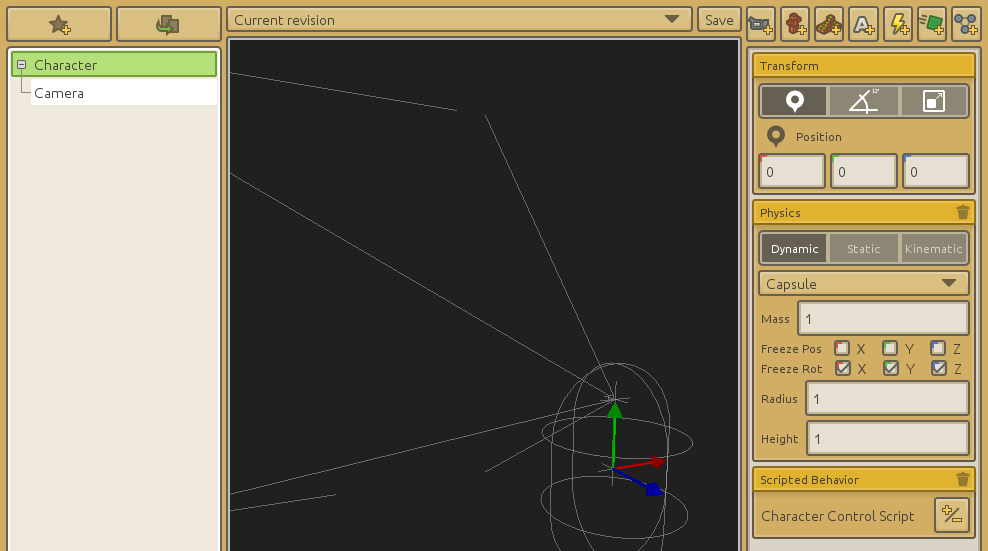

# Créer un jeu de tir à la première personne

----
## Contenu du tutoriel

Ce tutoriel suppose que vous savez déjà comment fonctionne CraftStudio. Si c'est votre premier jeu, allez plutôt lire [l'introduction](Introduction) et [commencez par un tutoriel pour les débutants](Space_shooter).

Nous allons réaliser un jeu de tir à la première personne basique, en mettant l'accent sur l'écriture de script du contrôle du joueur.

----
## Verrouillage de la souris à l'intérieur de la fenêtre de jeu

Pour permettre au joueur d'orienter la vue avec la souris, on va commencer par masquer et verrouiller le pointeur de la souris avec [```CS.Input.LockMouse()```](../Reference/Scripting/CraftStudio.Input). On permettra au joueur de déverrouiller en appuyant sur Echap avec ```CS.Input.UnlockMouse()``` couplé avec la fonction ```CS.Input.WasButtonJustPressed()```.

```lua
-- Script version 1 : Verrouiller & déverrouiller la souris

function Behavior:Awake()
    CS.Input.LockMouse()
end

function Behavior:Update()
    -- NOTE: Assurez-vous de définir un bouton de jeu "Escape" dans l'onglet Administration de votre projet
    if CS.Input.WasButtonJustPressed( "Escape" ) then
        CS.Input.UnlockMouse()
    end
end
```

Ce script doit être placé sur l'objet de jeu de votre caméra.

----
## Regarder autour de soi

Nous pouvons utiliser les valeurs renvoyées par [```CS.Input.GetMouseDelta()```](../Reference/Scripting/CraftStudio.Input) pour ajuster la rotation de la caméra.

On maintiendra la rotation autour de l'axe X (pour regarder en haut/bas) dans une zone raisonnable pour empêcher la caméra de faire un tour complet avec ```math.clamp( value, min, max )```.

Voici notre script de caméra mis à jour :

```lua
-- Script version 2 : Orienter la vue avec la souris

function Behavior:Awake()
    CS.Input.LockMouse()
    
    self.angleX = 0
    self.angleY = 0
    
    self.rotationSpeed = 0.2
end

function Behavior:Update()
    -- Déverrouillage de la souris avec Echap
    if CS.Input.WasButtonJustPressed( "Escape" ) then
        CS.Input.UnlockMouse()
    end
    
    -- On oriente la caméra lorsque la souris se déplace
    local mouseDelta = CS.Input.GetMouseDelta()
    
    -- Le mouvement horizontal de la souris correspond à une rotation autour de l'axe Y (gauche / droite)
    self.angleY = self.angleY - self.rotationSpeed * mouseDelta.x
    -- Le mouvement vertical de la souris correspond à une rotation autour de l'axe X (haut / bas)
    self.angleX = self.angleX - self.rotationSpeed * mouseDelta.y
    
    -- On s'assure que la rotation en X reste dans la zone -45° / 45°
    self.angleX = math.clamp( self.angleX, -45, 45 )

    self.gameObject.transform:SetLocalEulerAngles( Vector3:New( self.angleX, self.angleY, 0 ) )
end
```

----
## Avancer / reculer

Pour le déplacement avec collisions (via le moteur physique), on va séparer le personnage de la caméra. Cela nous permettra de mettre un composant physique sur le personnage lui-même tout en orientant l'objet caméra séparément.

Voici comment la scène peut être configurée :



Notez que le script ne se trouve à présent plus sur la caméra mais sur l'objet personnage et que la rotation de la capsule de collision du personnage a été gelée sur les trois axes.

Au lieu de modifier directement l'orientation du personnage, on modifiera l'orientation de l'objet caméra :

```lua
-- Script version 3 : Utilisation d'un objet séparé de la caméra 

function Behavior:Awake()
    CS.Input.LockMouse()
    
    -- AJOUT : on stocke une référence à l'objet caméra
    self.cameraGO = self.gameObject:FindChild( "Camera" )
    
    self.angleX = 0
    self.angleY = 0
    
    self.rotationSpeed = 0.2
end

function Behavior:Update()
    -- Déverrouillage de la souris avec Echap
    if CS.Input.WasButtonJustPressed( "Escape" ) then
        CS.Input.UnlockMouse()
    end
    
    -- On oriente la caméra lorsque la souris se déplace
    local mouseDelta = CS.Input.GetMouseDelta()
    
    self.angleY = self.angleY - self.rotationSpeed * mouseDelta.x
    self.angleX = self.angleX - self.rotationSpeed * mouseDelta.y
    self.angleX = math.clamp( self.angleX, -45, 45 )
    
    -- MODIFICATION : On définit l'orientation de la caméra
    self.cameraGO.transform:SetLocalEulerAngles( Vector3:New( self.angleX, self.angleY, 0 ) )
end
```

N'hésitez pas à ajouter une map avec un composant physique statique ainsi que divers obstacles.

Pour déplacer le personnage, on modifiera sa vélocité linéaire.

```lua
-- Script version 4 : Avancer / reculer

function Behavior:Awake()
    CS.Input.LockMouse()
    
    self.cameraGO = self.gameObject:FindChild( "Camera" )
    
    self.angleX = 0
    self.angleY = 0
    
    self.rotationSpeed = 0.2
    self.walkSpeed = 2.0
end

function Behavior:Update()
    -- Déverrouillage de la souris avec Echap
    if CS.Input.WasButtonJustPressed( "Escape" ) then
        CS.Input.UnlockMouse()
    end
    
    -- On oriente la caméra lorsque la souris se déplace
    local mouseDelta = CS.Input.GetMouseDelta()
    
    self.angleY = self.angleY - self.rotationSpeed * mouseDelta.x
    self.angleX = self.angleX - self.rotationSpeed * mouseDelta.y
    self.angleX = math.clamp( self.angleX, -45, 45 )
    
    self.cameraGO.transform:SetLocalEulerAngles( Vector3:New( self.angleX, self.angleY, 0 ) )
    
    -- Déplacement
    
    -- On calcule la nouvelle vélocité en fonction de la valeur de l'axe de contrôle Vertical
    local vertical = CS.Input.GetAxisValue( "Vertical" )
    local newVelocity = Vector3:Forward() * vertical * self.walkSpeed
    
    -- On transforme la vélocité de l'espace personnage à l'espace global avant de l'appliquer
    local characterOrientation = Quaternion:FromAxisAngle( Vector3:Up(), self.angleY )
    newVelocity = Vector3.Transform( newVelocity, characterOrientation )
    
    -- On restaure la valeur de la vélocité en Y afin de ne pas interférer avec la gravité
    newVelocity.y = self.gameObject.physics:GetLinearVelocity().y
    
    self.gameObject.physics:SetLinearVelocity( newVelocity )
end
```

----
## Déplacement gauche / droite

Un jeu de tir à la première personne n'est pas complet sans la possibilité de se déplacer de gauche à droite ([strafing](http://en.wikipedia.org/wiki/Strafing_%28gaming%29)).

```lua
-- Script version 5: Se déplacer de gauche à droite

function Behavior:Awake()
    CS.Input.LockMouse()
    
    self.cameraGO = self.gameObject:FindChild( "Camera" )
    
    self.angleX = 0
    self.angleY = 0
    
    self.rotationSpeed = 0.2
    self.walkSpeed = 2.0
end

function Behavior:Update()
    -- Déverrouillage de la souris avec Echap
    if CS.Input.WasButtonJustPressed( "Escape" ) then
        CS.Input.UnlockMouse()
    end
    
    -- On oriente la caméra lorsque la souris se déplace
    local mouseDelta = CS.Input.GetMouseDelta()
    
    self.angleY = self.angleY - self.rotationSpeed * mouseDelta.x
    self.angleX = self.angleX - self.rotationSpeed * mouseDelta.y
    self.angleX = math.clamp( self.angleX, -45, 45 )
    
    self.cameraGO.transform:SetLocalEulerAngles( Vector3:New( self.angleX, self.angleY, 0 ) )
    
    -- Déplacement
    local vertical = CS.Input.GetAxisValue( "Vertical" )
    local horizontal = CS.Input.GetAxisValue( "Horizontal" )
    
    -- Marche avant / arrière
    local newVelocity = Vector3:Forward() * vertical * self.walkSpeed
    -- Déplacement gauche / droite
    newVelocity = newVelocity - Vector3:Left() * horizontal * self.walkSpeed
    
    local characterOrientation = Quaternion:FromAxisAngle( Vector3:Up(), self.angleY )
    newVelocity = Vector3.Transform( newVelocity, characterOrientation )
    newVelocity.y = self.gameObject.physics:GetLinearVelocity().y
    
    self.gameObject.physics:SetLinearVelocity( newVelocity )
end
```

----
## Saut

(à venir)

----
## Tir

(à venir)