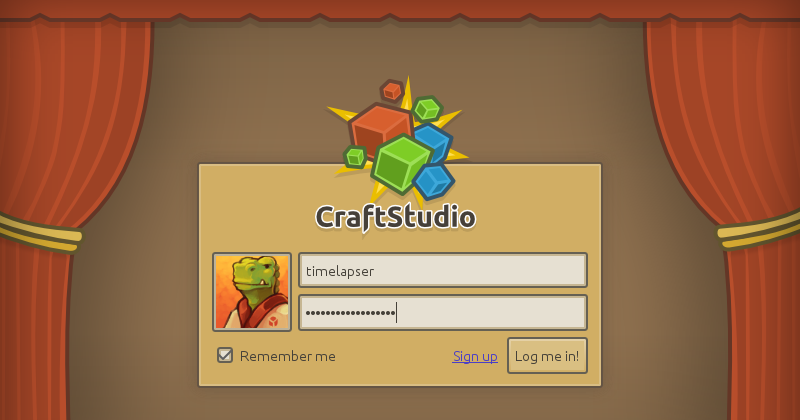
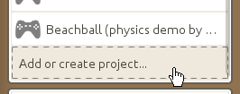
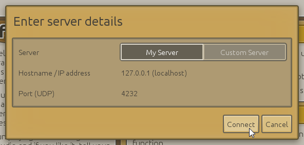
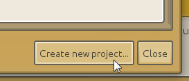
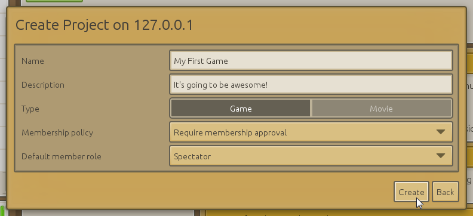
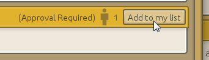
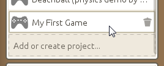

# Getting started with CraftStudio

----

## CraftStudio launcher

Once installed, the CraftStudio launcher lets you log in with your credentials and takes care of checking for CraftStudio updates before starting everything up.

Note that your username and password are *case-sensitive*. "timelapser" isn't the same as "Timelapser" or "TimeLapser".

----

## Online real-time cooperation & project access

CraftStudio is all about building together. Even when crafting on your own, your projects are managed by a server software which is independent from the main CraftStudio application, so that you can let people join you at any time to craft amazing things in cooperation.

When you create a new project, you can decide who can access it by choosing between 3 different membership policies as well as the default member role.

 * **Require membership approval**: This is the default policy, people can send a request to join your project and you can manually approve or reject it.
 * **Anyone can join without approval**: This one allows new people to join without asking for permission. It is recommended to only use it with **Spectator** as the default member role.
 * **Invite-only**: For anyone to join, you'll need to invite them through the Administration tab (not yet implemented)

For more details about managing servers and projects see the [Server Reference](../Reference/Server).

----

## Creating a new project

First of all, make sure your own server is running by clicking on the *My Server* button (and then clicking on *Start Server* if needed). Once you're all set, go to the bottom of your project list and click on *Add or create project...*

This will open up a popup which lets you decide which server you'd like to connect to. Simply click on *Connect* since we just want to connect to our own server, not someone else's.

In the new popup that appears, click on the *Create new project...* button.

Fill out a name and description (optional) for your project. If you want to, you can tweak the membership policy and default member role (as described earlier).

Don't worry though, you can always go back later and change everything from the project's Administration tab.

Once your project is created, make sure to add it to your project list by clicking the *Add to my list* button.

You're good to go! To open up your newly created project, just click on it in your project list.

Let's get started on [building a space shooter](Space_shooter), shall we?