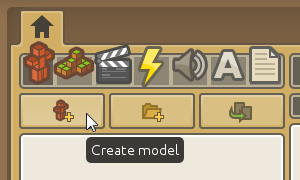
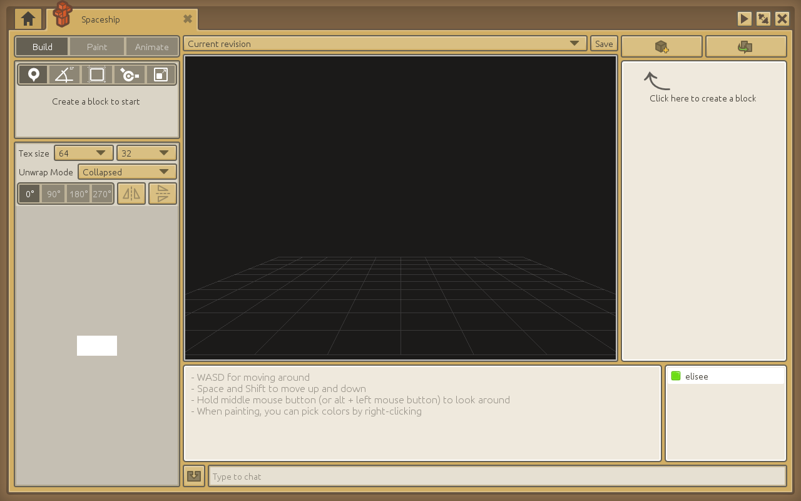
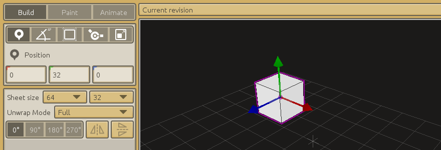
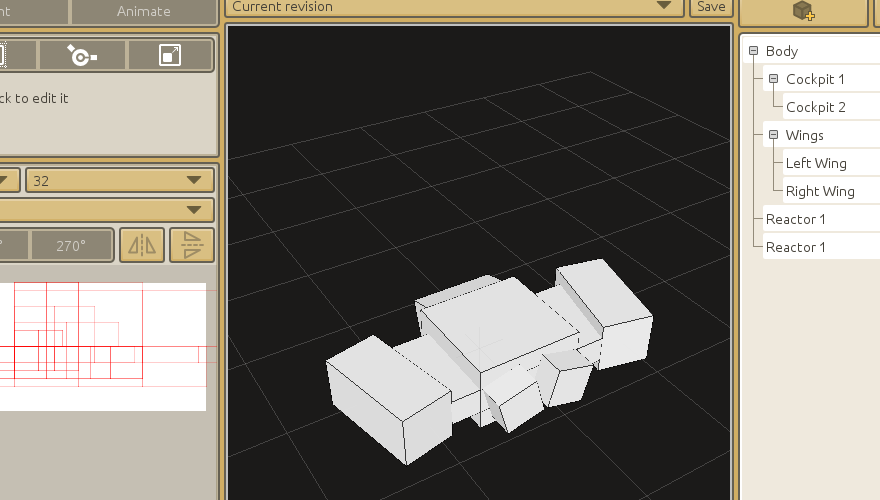
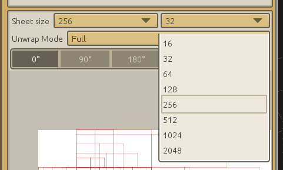
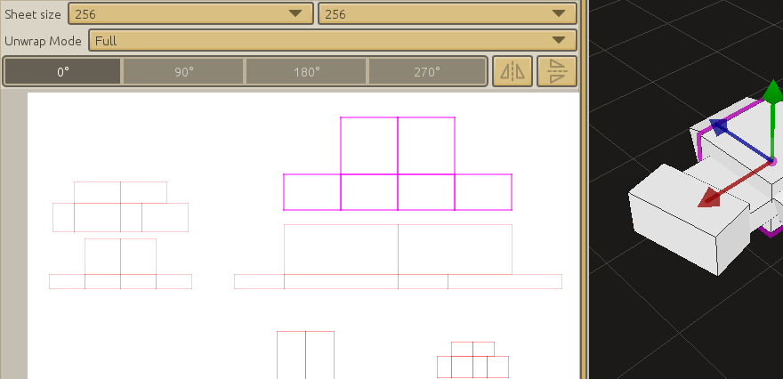

# Building a space shooter

----
## What's in this tutorial

This tutorial is for beginners, it doesn't assume you know much about CraftStudio at all. Make sure you start [by creating your first project](Introduction.md).

We'll be building a simple top-down space shooting game using visual scripting.

----
## Follow along!

To see the final result or draw some inspiration, you can check out [this space shooting game project](http://open.craftstud.io/craftstud.io/d922f33e-4691-44e0-b0e1-de693ec945b1).

----
## Building the space ship

First, we'll need to create a new model. Models are made of a bunch of blocks which you can draw on and are great for making characters, vehicles or objects.

Click on the "Create model" button as pictured above and enter a name for it ("Spaceship" is fine).

A new model editor tab will open.

At the center is the 3D viewport. You can rotate the view around by holding down the middle-mouse button and then moving the mouse. You can also zoom in and out by scrolling up/down with the mouse wheel.

On the right side of the screen, you'll find a list of all the blocks currently in your model. To create your first block, click on the little cube with a plus in the top right corner and then enter a descriptive name for it. For instance "Cockpit", "Body" or "Wing".

When a block is selected, it has a magenta outline. You can move it around by dragging the 3 arrows in the viewport. Each arrow corresponds to one axis and its current value is reproduced in the left pane. You can also type numbers directly in the left pane if you want a precise value.

There are 5 different tools you can use to work with blocks:

 * The **Position tool** is the default one we just talked about.
 * The **Orientation tool** lets you rotate your block around any axis.
 * The **Block Size tool** is for resizing your block.
 * The **Pivot Offset tool** is for moving your block relative to its center of rotation. It's mainly useful when working with articulated models like characters, for instance when you want to an arm to rotate around the shoulder rather than the middle of the arm.
 * The **Stretch tool** lets you stretch a block. It must not be confused with the Block Size tool and it's rarely useful as it doesn't increase the painting area associated with the block. Best to just ignore it for now.

To switch between the various tools, you can either click on them in the left pane or use the keyboard shortcuts (Z, X, C, V and B).

Create a few more blocks to make something that looks like a spaceship and try to keep your model centered on the grid.

Here are a few tips:

 * You can use the **F key** to focus your view around the selected block.
 * You can duplicate / mirror blocks around an axis by using the **Duplicate block** button in the top right corner. This is useful for left / right symmetry.
 * If needed, you can use the **WASD, Space and Shift keys** to move around the view. But most of the time, orbiting with the middle mouse button and using the F key should be enough.
 * You can **parent blocks to one another by dragging** and dropping them in the block tree on the right. When a block is parented to another, it will follow its parent when it is moved. It makes sense for the wings to be parented to the space ship's body for instance. This is mainly useful when animating though (which will be covered in a later tutorial).

----
## Prepare for painting

You should now have a basic ship blocked out. It might look something like this:

It's time for some color! While still in the Build tab, increase the drawing sheet's size to something more comfortable like 256x256:

Each and every one of your space ship's blocks have been unwrapped and placed on the sheet. But as you may notice, it's a mess! We need to lay them out correctly so that they do not overlap.

Select a block in the 3D viewport. Its unwrapped shape will be highlighted on the drawing sheet. You can drag it until it's in a more convenient place. Here's what mine looks like after a bit of tidying up:

----
## Painting

Click on the Paint tab to start drawing. Select a color by clicking the little white square right under the brush. You can increase or decrease the brush size by dragging the slider next to it.

Some useful tips:

 * Pick an existing color from the drawing sheet by **right-clicking**
 * Draw straight lines by **holding Shift down**
 * You can copy and paste from external programs **using Ctrl+C and Ctrl+V**.

----
## Setting up the scene

Let's create a scene to put our ship in!

Go back to the home tab (little black home in the top-left corner) and select the Scene icon

Click the "Create scene" button and choose a name (for instance "Game"). The scene editor will open.

Scenes are made of game objects. Each game object has at least a name and a so-called "Transform" component which handles its position, orientation and scale.

Start by creating a game object and name it "Spaceship".

You can move around in the scene using the WASD keys, Space (go up) and Shift (go down) and holding down the middle mouse button to rotate the view.

In order to display our ship, we need to tell the "Spaceship" game object to render it. Make sure the "Spaceship" game object is still selected in the game object tree on the left then click on the "Add model renderer" button in the top-right corner.

A "Model Renderer" panel will appear below the "Transform" panel. Click on the +/- button right next to "(No model selected)". This will open a popup window where you can tick off the little box next to the Spaceship:

Close the window and voilà! Your spaceship is now displayed in the scene. If you can't see it, double-click on the Spaceship game object in the game object tree on the left and the view will center on it (you can also **press F to focus** the currently selected game object when moving around in the 3D viewport).

Make sure the spaceship's position is 0, 0, 0, this will be useful for later.

----
## Camera

If you try to run the game now by hitting F5 or clicking the Play button in the top-right corner, CraftStudio will ask you to select the scene which should be used. Tick off the "Game" scene and click "Close". Your game will pop up as a black window.

Where's our spaceship you ask? Well since we haven't set up a camera, CraftStudio doesn't know from what point of view it should be displayed! Let's fix that.

Close the black game window and the "Runtime report" tab which just appeared and go back to the "Game" scene editor.

Click the "Create game object" button once again (the star with the little plus sign on it) and name the new game object "Camera". Make sure the Spaceship game object is not selected, otherwise the new Camera game object will be attached to it and we don't want that. Note that you can always reparent game objects later by dragging them in the game object tree.

Now, with our Camera game object selected, click the "Add camera" button:

Just like the Model Renderer component we added to our Spaceship game object earlier, this Camera component will give our Camera game object new capabilities. A pyramid-like shape will appear in the scene viewport:

The wireframe pyramid (or, more exactly, the frustum) represents the area which will be visible to the camera when the game runs. Move around the Camera game object until the spaceship is contained in it, then hit F5: the game window should appear and display your spaceship!

Since we want our spaceship to be shooting away from the camera, not at it, we'll need to turn it around. Here are the settings you might want to use:

 * Spaceship position: 0, 0, 0
 * Spaceship orientation: 0, 180, 0
 * Camera position: 0, 30, 20
 * Camera orientation: -45, 0, 0

You can start your game with F5 anytime you want to see how it looks.

----
## Eternal movement

Time to breathe some life into our game! Go back to the project home tab and create a script called "Spaceship Controls".

Make sure to that "Script Type" is set to "Visual".

Visual scripts are made of puzzle pieces that you can connect together. You can drag them around however you want. It's fairly easy, you'll see!

Green pieces define events that you can react to by connecting logic pieces into them.

 * The piece "When the behavior | self | is awoken" will be fired as soon as your game object is created. It is useful when you need to prepare stuff once for use later in the game.
 * The blocks connected into the "60 times a second with behavior as | self" piece will be repeated 60 times a second as long as your game object exists. That's where most of your game logic will happen!

At the top of the script editor, you'll find many categories: Events, Flow, Variables, Math, Game Object, etc. Go to the "Game Object" category and drag the "Move | game object | by | Global | offset | vector" piece into "60 times a second with behavior as | self":

For now we'll be moving our ship all the time just to test things out

There are two holes in this "Move" piece, so let's fill them in:
 
 * Go to the "Variables" category and drag the "Active game object" piece onto the "game object" placeholder.
 * Go to the "Math" category and drag "X | 0 | Y | 0 | Z | 0" onto the "vector" placeholder.

Moving something by an amount of zero doesn't do anything so change "X | 0" to "X | 0.1". The X axis is for left-right movement, a positive value will move the ship to the right and a negative value will move it to the left.

Now we need to let CraftStudio know which game object our script should affect. To do so, go back to the "Game" scene, select the Spaceship game object and click the "Add scripted behavior" button in the top right corner.

A component cartridge will appear, click on the "+/-" button in it and select our "Spaceship Controls" script.

Awesome! If you start the game now (with F5), your "Spaceship" game object will now move to the right! Try playing around with the "X | ... | Y | ... | Z | ..." piece in the script to make it move faster, slower or in different directions. You'll need to stop and start the game again to see your changes.

----
## Game controls

Having our spaceship move all the time in a particular direction isn't very interesting. Let's fix that! First, we'll need to define the buttons our game will be using. To do so, go back to the project home tab and click on the gear icon to open the Administration tab.

Switch to the "Game Controls" panel and delete the "Horizontal" and "Vertical" predefined controls, we won't be using them:

You should be left with just the "Fire" control. By default, it's bound to left mouse click but our game will be played with the keyboard so change the Input Source to "Keyboard" and the Key to "Space":

Now we're going to create two more buttons called "Left" and "Right".

Set up "Left" to whatever key you want to use for moving left, and do the same for "Right". All done!

----
## Moving around when pressing buttons

Now that we're all set up, go back to the "Spaceship Controls" script. We need to add a **condition** so that our spaceship will only move under certain circumstances (namely, when we press a button).

Go to the "Flow" category and drag the "If | boolean" block piece so that it connects at the top of the "60 times a second..." block piece.

A "boolean" is a value that can be either **true** or **false**. For instance, whether a button is currently pressed is a boolean, because it can either be pressed (true) or not be pressed (false).

Go to the "Input" category and drag "Is button down? | name" onto the "boolean" placeholder. In the "name" placeholder, type "Right" and then drag the "Move | ..." piece so that it's inside the "If" block.

Great! Our script will now check 60 times a second whether the "Right" button is currently pressed and our ship will only move when it is!

Click on the "If" piece and hit **Ctrl+D** on your keyboard to duplicate the whole block. Connect the new "If" block below the first one and replace "Right" with "Left" and "X | 0.1" with "X | -0.1" like so:

Hit F5 to start your game... you can move around the ship!  
(If the ship feels a little slow, you might want to increase its speed from 0.1 to 0.3.)

----
## Shooting animation

Whenever the spaceship shoots, it'll be playing an animation. Model animations let you modify block positions, sizes, orientations, etc. over time to make your models come to life.

Open the Spaceship model editor and go to the Animate tab.

Models can have several animations. Click on the "+/-" button to open the animation manager.

You can put it in a folder if you want. This is how I set it up:

Close the animation manager when you're done and let's look at the animation panel.

**Animations are played back at 30 frames per second**. The default animation duration is 30 frames, so it will last precisely one second. That's a bit long for shooting, so reduce it to about 10 frames, or a third of a second.

We don't need to animate every frame manually. We'll be using key frames to define the extremum of the movement at select points in time and CraftStudio will automatically interpolate in between.

Make sure your Frame slider is all the way to the left, at instant 0 and that you're in the Position transform mode. Select a block you want to animate and **click the "+" button to create a keyframe for that block, in that mode, at that instant**.

For my shooting animation, I'll move back the left and right cannons a bit at instant 0 and put them back where they were at the end of the animation (instant 10).

Remember, you'll need to create a keyframe for each block you want to animate, at each instant you want to pose it, and for each transform mode (position, orientation, size, etc.) you want to define.

And here's the animated result:

Pretty basic for sure, but it does the job!

----
## Playing the animation

Go back to the "Spaceship Controls" script. We're going to use the "Was button just pressed? | name" scripting block from the Input category. It differs from the "Is button down? | name" block in that it will only be true on the very frame the player started pressing a button. We only want the spaceship to shoot once each time the player starts pressing Space, not continuously.

Notice something else? I used "comment" blocks from the Flow category to organize our code a little bit better. You can put whatever you want as the title for a "comment" block, the label will be ignored by CraftStudio but is useful to find your way in your scripts as they grow larger.

Grab the "Set | model renderer | to play | animation" block from the Components category and fill up the first hole with "Component | Model renderer | of | Active game object" (from the Components and Variables categories) and the second hole with "Asset | full path | of type | Model Animation" from the Assets category.

Make sure to type the path to your animation asset in the "full path" hole. If it's in a folder, use slashes to separate the folder name from the asset name, like so:

If you launch the game now, you'll see the animation starts playing when you press Space, but it will loop again and again.

We need to set it up so that it only plays back once. We can use the "Start playback on | Model Renderer | looping | boolean" block to do so:

You can grab the boolean (true / false) block from the Variables category. Launch the game now and you'll see the animation only plays once every time you press Space.

----
## Spawning lasers

Our spaceship is going to shoot two lasers at once. Create a new model, just like you did for the spaceship, call it "Laser". Here's what mine looks like:

It's all flat but that doesn't matter considering it'll be seen from above.

We can't just add those lasers as game objects in the "Game" scene because we don't know in advance how many we're going to need: indeed, the player can shoot as many as they want.

We need to **instantiate** the lasers on the fly. To that end, we'll start by creating a new scene where we will set up our laser "prefab" (it's just a preconfigured game object that we'll be able to reuse easily at will). Let's put it in a "Prefabs" folder like so:

Open the new scene, create a single game object called "Laser" and place it at the origin in (0, 0, 0). Add a "Model Renderer" component on it with your Laser model:

Since this is a separate scene from our main one, nothing we add there will appear in the game right now. But we can insert the content of our prefab into our world using the "Append scene" script block from the "Misc" category:

(Note how there are two variants of this block, you need the beige one as the blue one can only be used as a standalone piece)

This will do! Right now, though, our game object will be created in (0, 0, 0), like it is in the prefab scene. We want to shoot out from our left cannon so let's move it in the correct spot:

We're using "Set | Global | position of ..." and "Global | position of ..." from the Game Object category, as well as the "value | + | value" block from the Math category to offset the laser.

Put it all into a "comment" block called "Left laser" and then duplicate it (using **Ctrl+D**) and update everything for the right laser.

----
## Laser behavior

So we can spawn lasers but they don't move yet! We need to give them a behavior of their own, just like we did for the spaceship. Create a new script called "Laser Behavior" and use the "Move | game object | by | Global | offset | ..." block.

Go back to the Laser prefab scene and add this script as a Scripted Behavior component on the Laser game object.

And that's it, our lasers are moving!

----
## Sound effects

Adding sound effects is both simple and satisfying! From the Home tab, select the Sound icon and create a new one. Call it "Shoot".

Click the "Import Sound" button and select a short WAV file from your computer. You can generate simple sound effects for your games [using BFXR](http://www.bfxr.net/).

Now go back to our "Spaceship Controls" script and we'll start playing that sound just after we start playing the shooting animation.

You'll find the "Play | sound" scripting block in the Assets category, combine it with "Asset | full path | of type | Sound" and you're done!

----
## Removing lasers after they leave the screen

With each laser we shoot, we're adding a game object to our world that has to be simulated even after it goes off-screen. In order to prevent our game from slowing down to a crawl after many lasers have been shot, we should destroy them when they are no longer useful.

We'll add a check in our "Laser Behavior" script and destroy the laser when it's no longer needed:

We're storing our object's position in a [local variable](../Reference/Glossary.md) so that we can access its .z [property](../Reference/Glossary.md). We use the comparison block from the "Flow" category to test if the position on the Z axis is less than -60 (you might need a different value depending on how you set up your camera angles) and only then do we destroy the laser.

----
## Enemy spaceship & prefab

Alright, time to add some foes for us to shoot at. Build a new ship model and call it "Enemy Spaceship". You can duplicate the player's spaceship and change the color, or build a new model entirely.

Just like before, make sure it's centered on the grid and pointing at you when you open the model.

Done? Good. Now create a new scene in the Prefabs folder called "Enemy Spaceship". It should contain a single game object located at the origin (not in 0, 0, -5! Make sure to change the position so that in 0, 0, 0) and the following two components:

 * A Model Renderer component with the enemy spaceship model
 * A Scripted Behavior component with a new script called "Enemy Behavior" (You can create the new script right from the script selection window you get when clicking on the "+/-" button)

----
## Enemy health and movement

Our enemies will have some health so they can take multiple hits. We'll set it up in the "When the behavior | self | is awoken" event block:

----
## Spawning enemies randomly

To make the game interesting, rather than placing enemy ships directly in our Game scene, we'll be creating enemies every once in a while at a random position (by "rolling a dice").

Open the "Game" scene and create a new game object called "Enemies". Add a Scripted Behavior component on it with a new script called "Enemy Spawner".

To only spawn a ship every once in a while, we'll be using a "Random integer between | 1 | and | 60" scripting block and checking whether its value is 1. It'll be like rolling a 60-faces dice very fast (60 times a second) and doing something whenever we roll a 1:

This script will print "We rolled a 1!" to the console using the Print block from the "Misc" category. That was just a test though, remove the Print block and replace it with our actual enemy spawning logic:

See what we did? We're instantiating our "Enemy Spaceship" prefab then moving it to a random horizontal spot far back so that it enters the screen as it moves.

----
## Hitting enemies

Now all that's left to do is for our lasers to actually damage our enemies.

The way we'll do this is by having each laser loop over all enemies. When an enemy is close enough to the laser to be hit, we'll send a message to the enemy so that it takes damage and destroy the laser.

Notice I moved the "position" local variable out of the "Destroy the laser when it's off-screen" block and put it at the top so we can reuse it.

The "For each ..." block can be found in the "Flow" category. It repeats our laser collision logic for each child of our "Enemies" game object.

See that "Send message | Damage | to | ..." block? We need to react to that message.

Go to the "Enemy Behavior" script and create a "On message | ... " scripting block by dragging it out from the "Events" category. Enter "Damage" as the message name and fill it out like so:

We're decreasing the enemy ship's health by one and then checking if it reached zero, in which case, we'll destroy the ship. We could play an explosion sound effect there, too.

----
## Going further...

Congrats on your first CraftStudio game! Here are some ideas you could explore to improve it:

 * Add a starry background by creating a model with a single flat block and attaching it to a game object in the "Game" scene.

 * Add some health to your own ship and remove one everytime an enemy ship passes the bottom of the screen. When health reaches zero, you could switch to a game over scene using the "Switch to scene | ..." block from the "Misc" category.

 * You could keep track of a score, increase it whenever a ship is destroyed and display it using a "Text Renderer" component and [a font asset](http://forums.craftstud.io/index.php?threads/building-your-own-fonts.1260/#post-8098).